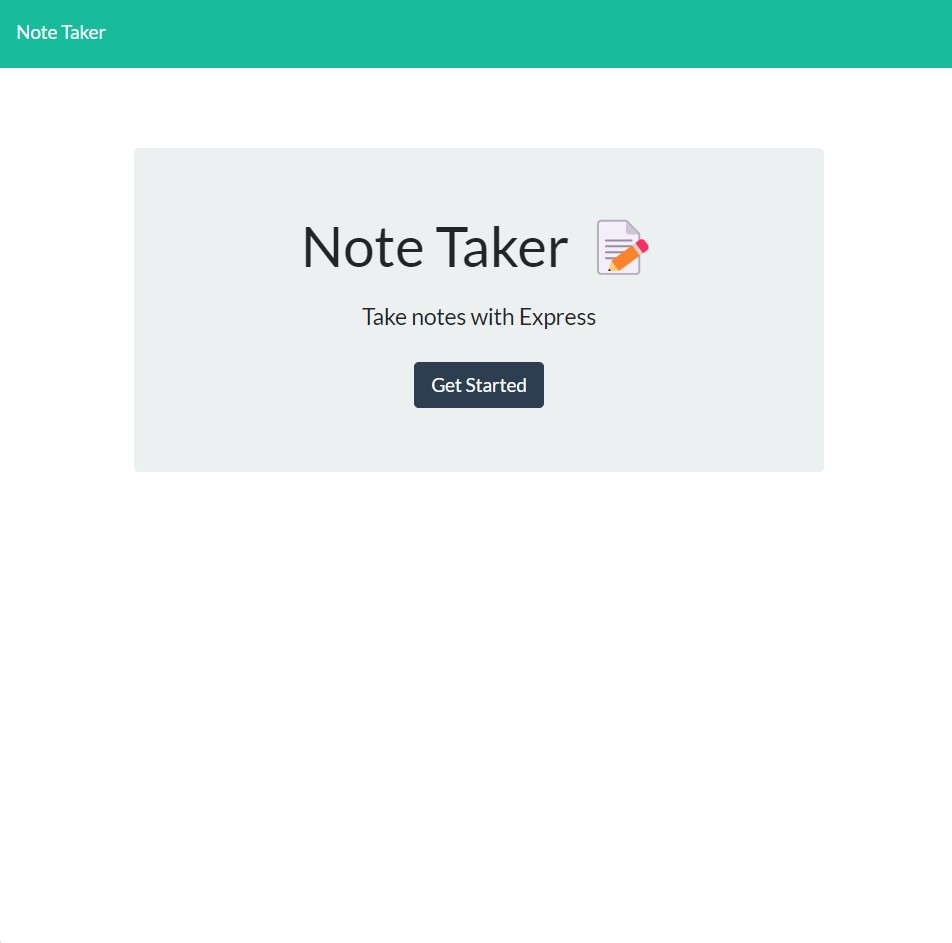

# Note Taker

## Description

In this application, users will be able to reach a site that will have a get started button. After clicking that button, users will be able to write, save, and delete notes in the site. This site will save all of the messages when the save button in the top ritht is clicked, and will removed the messages for good when the red trash bin by the message is clicked.

## Technologies Used

This application is operated using Node.js and Express.js. To download these technologies that are required, simply download both of those that are listed above.

## Download

The command to download the technologies is ``npm i`` after moving into the repository in your terminal.

## Acceptance Criteria
GIVEN a note-taking application
WHEN I open the Note Taker
THEN I am presented with a landing page with a link to a notes page
WHEN I click on the link to the notes page
THEN I am presented with a page with existing notes listed in the left-hand column, plus empty fields to enter a new note title and the note’s text in the right-hand column
WHEN I enter a new note title and the note’s text
THEN a Save icon appears in the navigation at the top of the page
WHEN I click on the Save icon
THEN the new note I have entered is saved and appears in the left-hand column with the other existing notes
WHEN I click on an existing note in the list in the left-hand column
THEN that note appears in the right-hand column
WHEN I click on the Write icon in the navigation at the top of the page
THEN I am presented with empty fields to enter a new note title and the note’s text in the right-hand column

## Links

### Link to GitHub Deployed
[Note-Taker Application](https://renbryant.github.io/Notes-Express/)

### Link to Heroku Deployed
[Heroku Note-Taker Application]https://noteries-express.herokuapp.com/)

## Contributors

The only contributor for this project is RenBryant. (https://github.com/RenBryant)

### Thank you for checking out this project.

